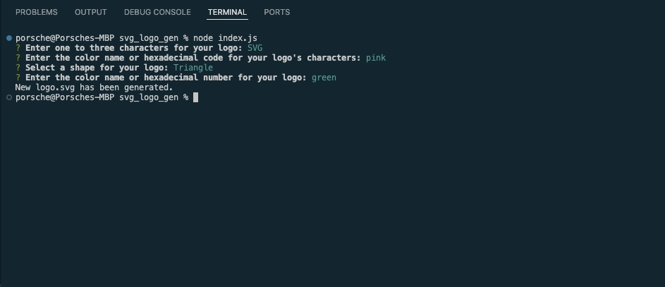

# SVG Logo Generator

## Table of Contents

* [Description](#description)
* [Installation](#installation)
* [Usage](#usage)
* [Credits](#credits)
* [Technologies Used](#technologies-used)
* [License](#license)

## Description
The SVG Logo Generator provides users with an easy-to-use program to create a custom SVG logo. User input taken from a series of prompts is applied to the program to produce an SVG logo using either a circle, triangle, or square shape.

Future development for this app could include additional design parameters for the user to choose from to produce non-standard shapes and custom color preferences such as borders and opacity.

> 📝 **Easter Egg:** Entering "ILY" and choosing the circle shape will generate a fun surpirse!

## Installation
* [Inquirer v8.2.4](https://www.npmjs.com/package/inquirer/v/8.2.4) must be installed to operate this app.
* [Jest](https://jestjs.io/docs/getting-started) must be installed to operate testing for this app.
* [VS Live Server](https://marketplace.visualstudio.com/items?itemName=ritwickdey.LiveServer) is required to open the logo.svg via the browser.

## Usage
[Clone the repository](https://github.com/eepitsporsche/svg_logo_gen) to your machine and open the application in VS Code.

To initiate the SVG Logo Generator, enter the <code>node index.js</code> command into the index.js terminal.

After answering the prompts, an SVG file entitled "logo.svg" with the user's response parameters applied will be created.
Opening the file via the live server will allow you to view the generated logo.svg.

To initiate the testing of the SVG Logo Generator, enter the <code>npm test</code> command into the terminal.

> [Click here](https://drive.google.com/file/d/1jeSethZNHqkaDba_ocOdXwIx39oQB7Pl/view?usp=sharing) to view the video walk-through.

## Credits
* [mdn web docs_](https://developer.mozilla.org/en-US/docs/Web/SVG/Attribute/shape-rendering) for information on SVG shape-rendering
* [w3 Schools](https://www.w3schools.com/graphics/svg_intro.asp) for information on SVG
* [Sanjay Chopra Youtube Channel](https://www.youtube.com/watch?v=m9oC3wo6JW4) for example walk-through
* UCB Bootcamp provided guidance for directory structure and test function framework for this project.

## Technologies Used
* VS Code
* JavaScript
* Node.js
* Inquirer

## License
<a href="https://opensource.org/licenses/MIT">MIT License</a>

Copyright© 2024 Porsche Herskorn

Permission is hereby granted, free of charge, to any person obtaining a copy of this software and associated documentation files (the "Software"), to deal in the Software without restriction, including without limitation the rights to use, copy, modify, merge, publish, distribute, sublicense, and/or sell copies of the Software, and to permit persons to whom the Software is furnished to do so, subject to the following conditions:

The above copyright notice and this permission notice shall be included in all copies or substantial portions of the Software.

THE SOFTWARE IS PROVIDED "AS IS", WITHOUT WARRANTY OF ANY KIND, EXPRESS OR IMPLIED, INCLUDING BUT NOT LIMITED TO THE WARRANTIES OF MERCHANTABILITY, FITNESS FOR A PARTICULAR PURPOSE AND NONINFRINGEMENT. IN NO EVENT SHALL THE AUTHORS OR COPYRIGHT HOLDERS BE LIABLE FOR ANY CLAIM, DAMAGES OR OTHER LIABILITY, WHETHER IN AN ACTION OF CONTRACT, TORT OR OTHERWISE, ARISING FROM, OUT OF OR IN CONNECTION WITH THE SOFTWARE OR THE USE OR OTHER DEALINGS IN THE SOFTWARE.

### 
[Back to Top](#svg-logo-generator)
